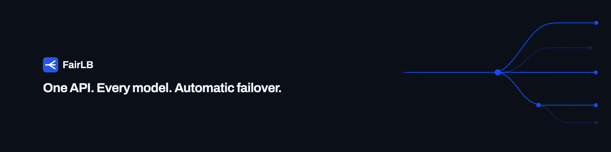

# FairLB

**Native where there is a protocol. One API where there isn't.**

FairLB is a multimodal AI model gateway. Text and images go through native
OpenAI, Anthropic and Gemini APIs — each protocol keeps its own paths, headers
and streaming events, and nothing is translated into a single dialect on the way
through. Video has no such protocol to keep, because no video vendor publishes
one the others speak, so FairLB publishes its own: one asynchronous job API
across every video model it carries. Both planes share one key, one catalog,
automatic failover, per-key budgets and one usage ledger.

```bash
curl -fsSLO https://raw.githubusercontent.com/fairlb/fairlb/main/docker-compose.yml
docker compose up -d
```

Open <http://localhost:8080> and fill in the setup form. That signs you in —
there is no second command, and no database to bring yourself.

Then create a key in the admin UI and point any OpenAI client at it:

```python
client = OpenAI(base_url="http://localhost:8080/v1", api_key="sk-flb-v1-...")
```

## What it does

- **Three native surfaces, many providers** — OpenAI's `/v1/chat/completions`,
  `/v1/responses`, `/v1/embeddings` and `/v1/images`; Anthropic's `/v1/messages`
  and token counting; Gemini's `/v1beta/models/{model}:generateContent` and the
  rest of its `/v1beta` routes. Requests pass through: the gateway validates only
  what routing and accounting need, everything else goes upstream untouched.
- **Automatic failover** — candidate rotation across providers with circuit
  breakers, retry budgets, and per-provider cooldowns.
- **Virtual keys with budgets** — per-key spend limits (daily/monthly/total),
  RPM/TPM caps, model allowlists, expiry.
- **Usage and cost accounting** — every request logged with token counts and
  priced against the price table you configure; rollups for charts.
- **Admin UI** — configure providers, models, routes, and pricing from a browser.

## Documentation

[docs/](docs/) — [architecture](docs/architecture.md),
[configuration](docs/configuration.md), [deployment](docs/deployment.md),
[development](docs/development.md), and the
[design notes](docs/README.md) behind the choices that look arbitrary until you
know what the alternative cost.

## Requirements

Docker, or Go 1.26 and PostgreSQL 18 if you would rather build it yourself.
Redis is optional — the in-memory drivers are the default, and Redis is what
makes rate limits and circuit-breaker state shared across replicas.

## Configuration

Environment variables, all with working defaults except `DATABASE_URL`.
[.env.example](.env.example) covers the ones you are most likely to want;
[docs/configuration.md](docs/configuration.md) is the full list, generated from
the code that reads it. Migrations run on start.

Two worth knowing about:

- **`SECRET_KEY`** encrypts provider credentials at rest. Leave it unset and one
  is generated on first start and kept in the data volume, which is what you
  want for a single instance — a key that changes on every start would leave
  yesterday's credentials unreadable, with no error to say so. Set it explicitly
  when running more than one replica, since they do not share a volume.
- **`PUBLIC_URL`** is the address people reach you at. It decides whether the
  session cookie carries `Secure`, so it has to match how the browser actually
  connects. Behind a TLS-terminating proxy, set the https URL and
  `TRUST_PROXY=true`.

## FairLB Cloud

If you'd rather not run it yourself, **FairLB Cloud** is the hosted version:
same gateway, plus multi-tenancy, prepaid credits, and a support commitment.
The gateway you see here is the gateway that runs there.

## Contributing

See [CONTRIBUTING.md](CONTRIBUTING.md). Note the unusual bit: development
happens in a private repository and lands here as export snapshots — your PRs
are still very welcome, they just take a slightly different path home.

## License

[Apache-2.0](LICENSE). "FairLB" is a trademark — see [TRADEMARKS.md](TRADEMARKS.md).
